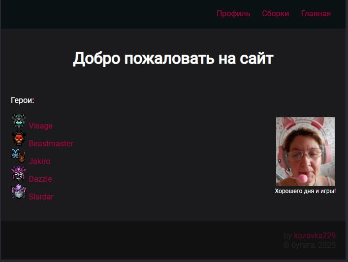
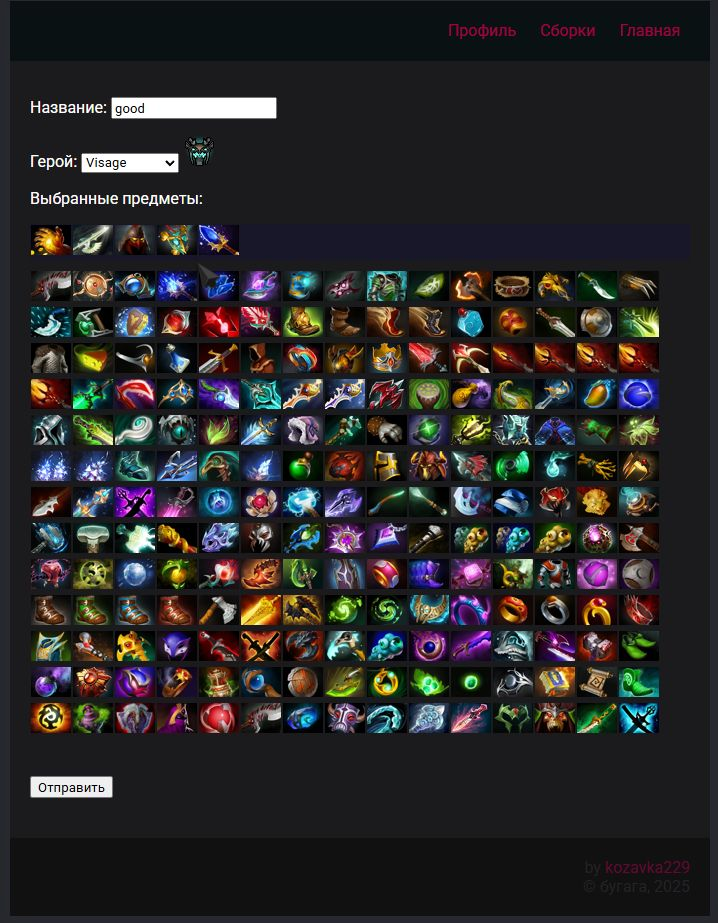
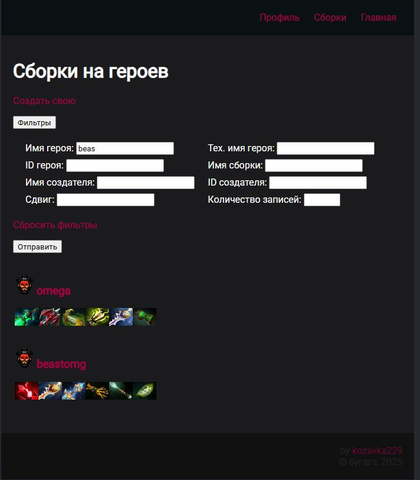
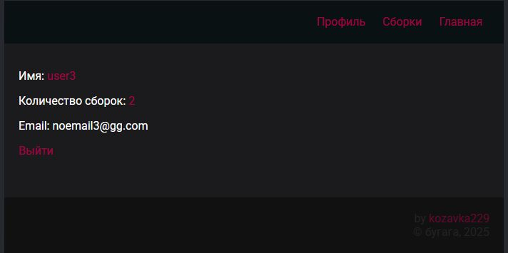

#  DOTA2BUILDS site
<p>pet-project</p>


## How to run
- Add *dota2site.localhost* and *cdn.dota2site.localhost* to *hosts* file
- Run it
```console
chmod +x demo-run.sh && ./demo-run.sh
```
- Open http://dota2site.localhost

## Overview

### Used technologies
- Main language: ***Python***
- Main framework: ***Django***
- Database: ***Postgresql***
- Configure by .env file ([example](./example.env))
- Also used: ***Docker***, ***allauth python lib***

### Features
- Users can login by login+password and by social accounts in ***github.com*** (require set in [.env](./example.env))
- ***Email verification*** of users
- Loggined users can create builds with ***build editor***:<br>

- View ***filters*** for builds:<br>

- Users profiles:<br>


